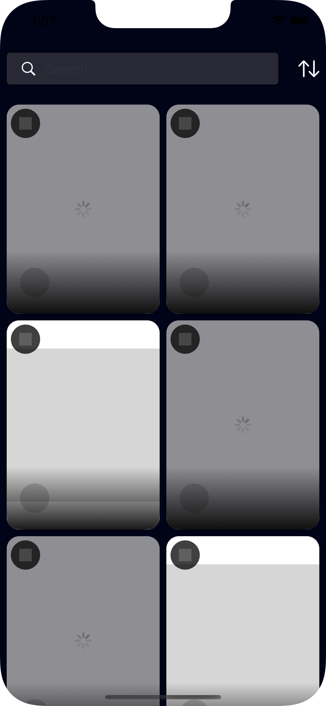
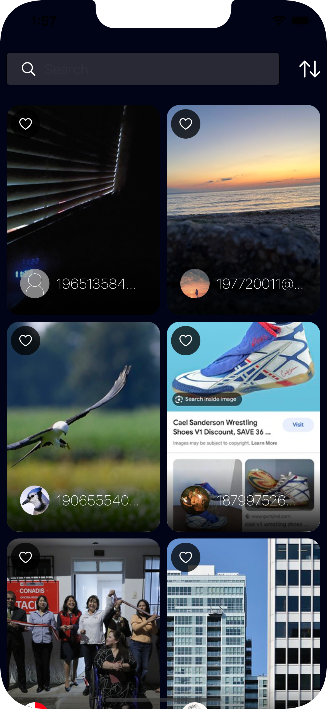
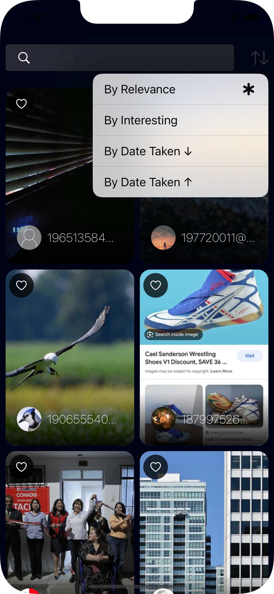
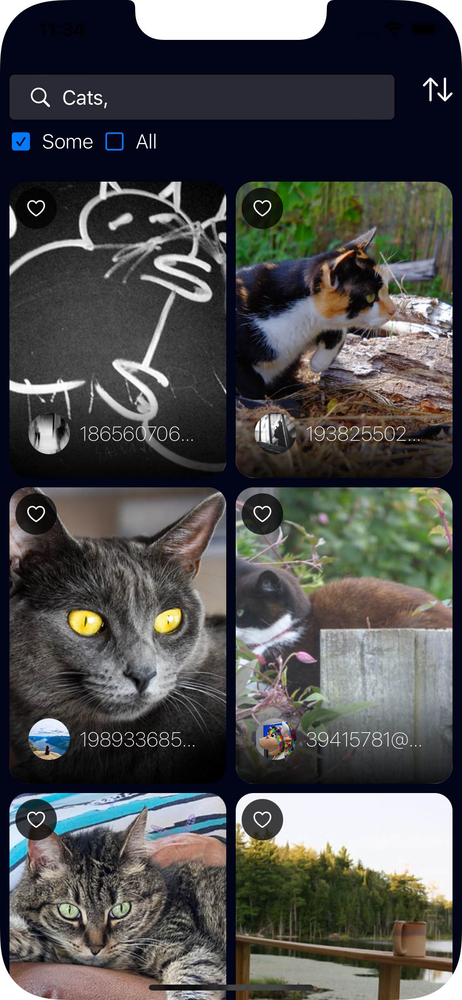
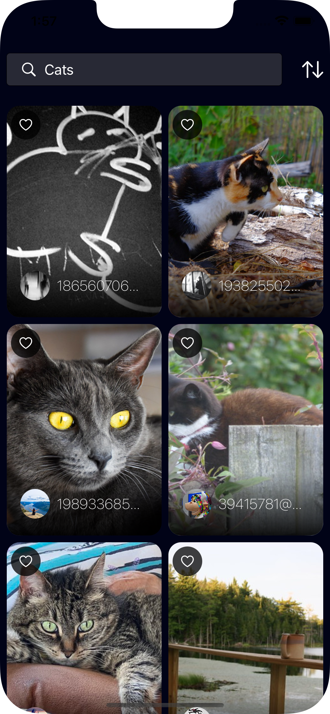
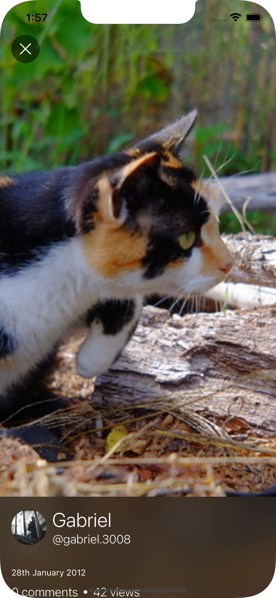

# Yorkshire Business Society
       
## Navigating the app
- On the `SearchView` you can scroll as much as you want it has pagination so new images will be added.
- On the `PhotoDetail` swiping up will expand the bottom menu to show more information and swipe down will hide it.
- On the `UserDetails` I am using a bottom sheet which uses 3 different heights, [Small, Mid, Large], purpose of this is to only show some initially.
- On the `UserDetails` the background images are swipable.

## Project Decisions
### Structure
- I have chosen to use `MVVM` as it separates UI, data presentation, and business logic by utilizing a ViewModel to mediate the communication between the View and Model.
- I have broken the project into sections of the app such as Search, PhotoDetails and UserProfile, each consisting of ViewModels & Views corresponding to the page.
- I have an `Infrastructure` folder which contains files such as AppDelegate, BaseClasses, Navigation, Notifications, Utils, Extensions etc.
- I have moved the `services` into their own target to keep it away from the main application and not clutter the main project.
- I have chosen to use `SwiftUI` as it allows for faster development, though it has its downsides.
- I have implemented `DependencyInjection` for better mantainability and testability of the application.
    
### Services
- I have chosen to use `Combine` for a 2 reasons:
    1: Combine its already been out for a while and a lot of projects are already using it.
    2: The job required it and I wanted to showcase that I know how to use it (By no means am I an expert)
- I would've probably used `async/await` for this as it would have been far simpler and for what I had to do it would've been more than acceptable.
- Overall I would use Combine when dealing with more complex data streams and handling multiple publishers that need to be composed.

### What I would have done with more time:
- Better error handling
    - Errors and Crashes are something that should be caught either by using something like Firebase Analytics or Sentry
    - Currently other than displaying an image nothing is different, they can tap on a button to refresh but an alert would be more appropriate as it could tell them what the problem is.
- Tests
    - In an actual app I would've used a framwork such as Mockingbird to create mocks of each service rather than make them myself.
    - I would've tested more functionality in the ViewModels such as pagination, search query.
    - Isolating the views from triggering `onAppear` functionality when running `UnitTests` (using EnvironmentVariables)
    - Writing Snapshot Tests:
        - I would've created some snapshots tests as a simple and quick way of checking that everything is looks good.
        - Decided not to as they can be a bit tempermental from my experience and I have personally removed it from the build & test pipeline, it has its own test pipeline which I check whenever it fails as just a simple iOS or XCode version could to break it.
    - Writing UITests would be a must in order to verify the flow of the app is still functioning and nothing has been missed or broken during development and it would help a lot with regresion tests.
- I would've followed the design system better and create some color pallets rather than using Color.white, Color.black etc and apply opacity to them

### With more time
- Search
    - Implemented the filters, very similar to how search query/tags works.
    - I would've pills within the `TextField` when searching for tags.
- PhotoDetails
    - List the tags in an even and dynamic manner.
    - Match the designs with the `UserDetails` view.
- UserDetails
    - Make the background into a carousel and make the elements snap rather than free scroll.
    - Create a custom bottom sheet so that I have more control over the transition or just re-design the page.
    - Create the `UserGallery` view and display them in a way that the user can zoom, move, save, share etc.
- Development
    - I would've added an authentication view.
    - I would've added more tests `Snapshot`, `UITests` cover the Services to a certain extent.
    - I would've added a local database to store some details about the user and only refresh them after they expire or the user asks for them.
    - I would've implemented better navigation  by following the `MVVM-C` pattern.
    - In an actual application I would think about `accessibility` and how to better help people navigate the app.
    - I will not deny that the design took a lot longer than I wanted it to, I went through 3 different itterations.
    - On the UserProfile there is a `Show all` gallery button whih I didn't implement because I couldn't think of a good design.
- Not very practicle
    - When navigating back from the `UserProfile` the `BottomSheet` is still visible for a few a seconds or so.
    - When navigating back from the `PhotoDetails` to the `Search` if we have searched for something prior to us navigating when returning the search query URL will be triggered.
    - There are some design inconsistencies, I used a couple different shots from Dribble.
    - On the `PhotoDetails` the tags are not aligned well and are even getting cut off, at this point in time I want to stick purely with SwiftUI and not use UIKit.
 
## Requirements
### Pages
- Create a Search Page (Should be using pagination)
    - Each photo element should contain (Image, OwnerId, OwnerIcon)
    - Alongside the image there should be a list of tags associated with the photo
    - Tapping on the photo should take the user to the Details Page
    
- Create a Details Page
    - The page should contain the following (Image, Title, Date Taken, Description etc)
    - It should also display the Owners Information (Id, Name, Icon)
    - Tapping on the Owner should take us to a Owners Content Page
    
- Create a OwnerImages Page (Should be using pagination)
    - It should display a list of all the photos the owner has uploaded
    
## Features
- Search
    - [x] Should be able to search by 1 or more tags and have an option to choose between the 2
    - [ ] Allow to search for photos by username (I was not able to find an API that would allow for a username)
    - [ ] Anything else that I can think of
    - [x] Tap on Image: Navigate to the PhotoDetails Page
    - [x] Implemented Pagination

- PhotoDetails
    - [x] Details: Image, Title, Date Taken, Description, Tags, Comments, Views
    - [x] Owner Information: Avatar, Realname, Username
    - [x] Tap on Owner: Navigates to the User Profile/Content Page
    
- UserProfile
    - [x] User Information: Avatar, Realname, Username, Location, First Ever Picture Date Taken, Total Images
    - [x] Gallery: List of images with pagination
    - [ ] Show all: Didn't implement this view as I ran out of design ideas 

## API Calls/Response
- RecentImages: https://www.flickr.com/services/rest/?method=flickr.photos.getRecent&api_key=596e9e64e3303403d4e4913571ddf4de&format=json&nojsoncallback=1

- Search
    - By Text: https://www.flickr.com/services/rest/?method=flickr.photos.search&api_key=596e9e64e3303403d4e4913571ddf4de&text=<text>&format=json&nojsoncallback=1
    - By Tags: https://www.flickr.com/services/rest/?method=flickr.photos.search&api_key=596e9e64e3303403d4e4913571ddf4de&tags=<tags>&format=json&nojsoncallback=1
    - By Username: Could not find the appropriate end-point where I can pass the username, I can pass the userId but this would require an extra call to see if there is a user with that username and if so get the nsid
    
- PhotoInfo: https://www.flickr.com/services/rest/?method=flickr.photos.getInfo&api_key=596e9e64e3303403d4e4913571ddf4de&photo_id=<photo_id>&secret=<secret>&format=json&nojsoncallback=1

- User
    - Info: https://www.flickr.com/services/rest/?method=flickr.people.getInfo&api_key=596e9e64e3303403d4e4913571ddf4de&user_id=<nsid>&format=json&nojsoncallback=1
    - Photos: https://www.flickr.com/services/rest/?method=flickr.people.getPhotos&api_key=596e9e64e3303403d4e4913571ddf4de&user_id=<nsid>&format=json&nojsoncallback=1
    
- API Call: https://www.flickr.com/services/api/flickr.photos.search.html
    - Parameters that need to be changed
        - user_id
        - tags
        - text
        - per_page = 20
        - page
- URL Image: https://live.staticflickr.com/{server-id}/{id}_{secret}.jpg
    -  https://live.staticflickr.com/65535/53139302418_9de03c12f7.jpg
- Avatar URL Image: "https://farm\(iconfarm).staticflickr.com/\(iconserver)/buddyicons/\(nsid)"
    - https://farm66.staticflickr.com/65535/buddyicons/152463379@N03_l.jpg
    
## Screenshots

|   |   |   |
| ------------------------ | ------------------------ | ------------------------ |
|   |   |   |
|   |   |                          |
|   |  |  |
